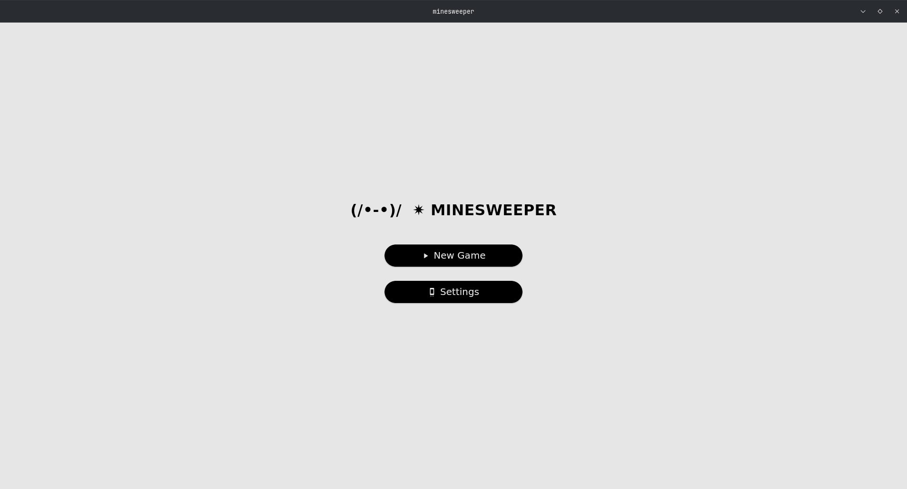
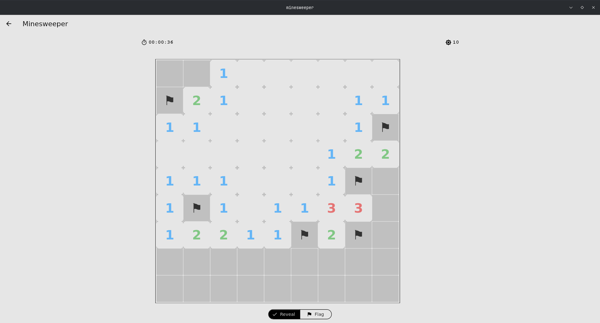

# Minesweeper

Un clon moderno y responsivo del clásico juego Buscaminas (Minesweeper) construido con Flutter. Diseñado especialmente para dispositivos móviles, cuenta con controles táctiles, soporte para hacer zoom-in y zoom-out, y un sistema de temas para pesonalizar la experiencia de cada jugador.

## Capturas de Pantalla

<div align="center">
  
  &nbsp;&nbsp;&nbsp;&nbsp;
  
</div>

## Características

* **Jugabilidad:** Todo el comportamiento tradicional del Buscaminas.
* **Controles:** Selecto inferior para alternar rápidamente entre "revelar celdas" y "poner banderas".
* **Tablero interactivo:** Navegación fluida por el tablero usando gestos de zoom y paneo.
* **Temas:** Cambia los colores de la aplicación al instante desde el menú de ajustes.

## Cómo ejecutar el proyecto

1. Asegúrese de tener [Flutter](https://docs.flutter.dev/get-started/install) instalado.
2. Clone este repositorio usando `git`.
3. Abra una terminal en la raíz del proyecto y ejecute:

```bash
flutter pub get
flutter run
```

